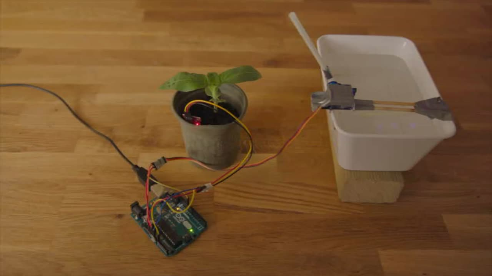

# Automatische plantbewatering

Een simpel bewateringssysteem met een arduino, een servomotor en een vochtigheidssensor voor de bodem.



## Benodigdheden

- Een arduino (eender welke arduino is goed)
- Een [bodemvochtigheidssensor](https://www.aliexpress.com/store/product/Soil-moisture-sensor-Moisture-Sensor-For-Arduino-automatic-watering-system/110055_1061832950.html)
- een servo-motortje, bv [deze](https://www.dx.com/p/p0037-diy-plastic-iron-steering-engine-servo-for-r-c-toy-light-blue-white-4-8-6-0v-335294) Een standaard hobby servo is perfect, hij moet niet veel kracht hebben aangezien hij alleen maar een rietje moet bewegen.
- jumper kabels om alles te verbinden
- Een drinkrietje, met een vouwbaar stukje vanboven
- Een tank met water
- wat duct-tape (of andere waterdichte plakband)

En ... een plantje dat dorst kan hebben.

## Aansluitingen


- De sensor heeft stroom (3.3v), ground en een signaal naar A0.
- De servo motor heeft stroom (5v), ground en een signaal naar poort 11.

## Waterbasin met servo motor

Plooi het rietje zo dat het in een rechte hoek staat.
Bevestig het rietje zo aan de servo dat het onder water staat als de servo niet aangesloten is.

## Configureren

Er zijn twee parameters die je kan aanpassen:

```
const int minMoisturelevel = 100;
```

Dit is de ondergrens van de vochtigheid. Als de sensor een waarde meet onder deze waarde, gaat het programma er van uit dat de grond te droog is en dan schiet de servo in actie om de plant water te geven.

```
const int ServoPosStart = 180;
const int ServoPosWatering = 90;
```

Dit zijn de twee posities van de servo. Je test dit best uit voordat je de servo vastmaakt. Als de hoek niet klopt, kan je deze waardes aanpassen.

## Code laden en testen

Via de arduino IDE kan je de code laden op je arduino, alles testen en daarna de code zijn werk laten doen en het plantje op tijd water geven.

Veel succes!


